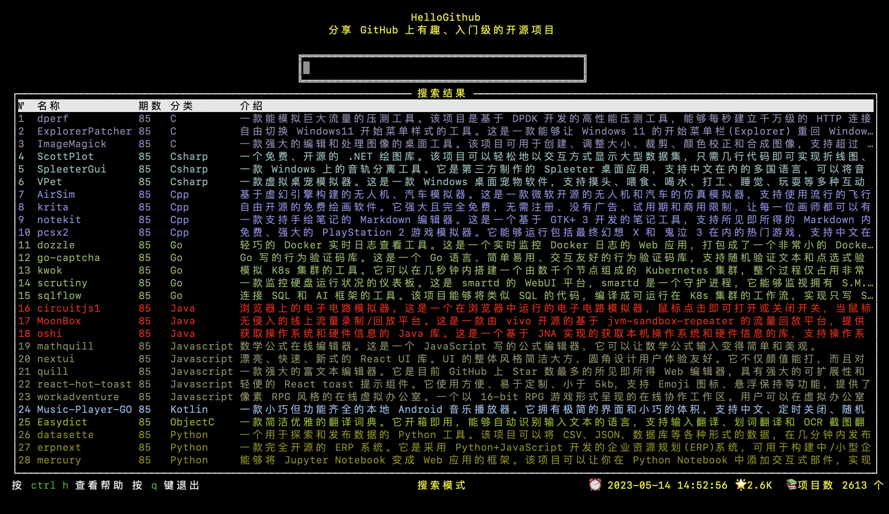

# 仿hellogithub 的hg-tui
> htllogithub [hg-tui](https://github.com/521xueweihan/hg-tui)

仿hellogithub 的hg-tui

采用golang + tview框架

</img>

## 目前主要完成 
1. [x] 列表页展示
1. [x] 期数跳转
1. [x] h/l 上一期下一期

# 未完成
1. [] 搜索关键词功能
1. [] 搜索分类功能

